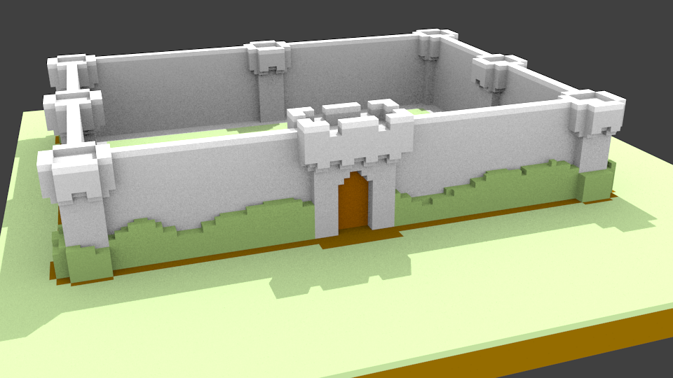
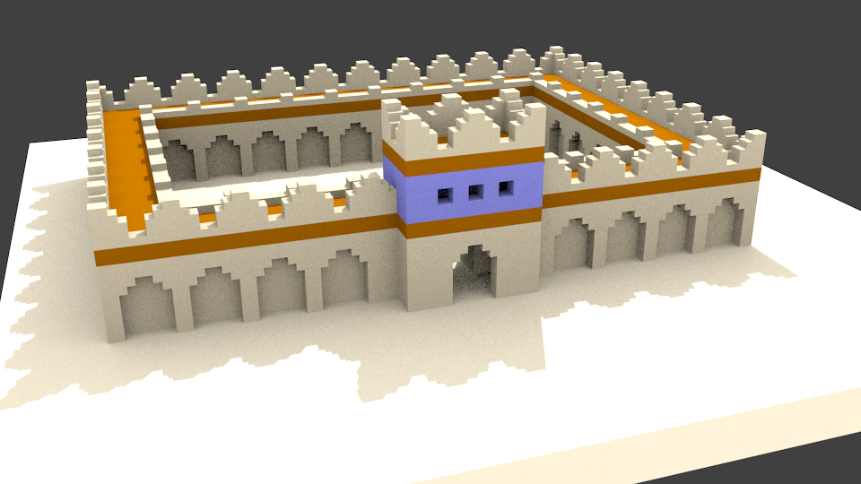

# Create 3D buildings with voxel 

just trying to reproduce some design seen here: http://imgur.com/gallery/WTeR8

it create the buildings in a 3 dimensional grid and export it to a .obj/.mtl file. Those files can be imported to Blender to render.

## The fortress

### The desert castle

